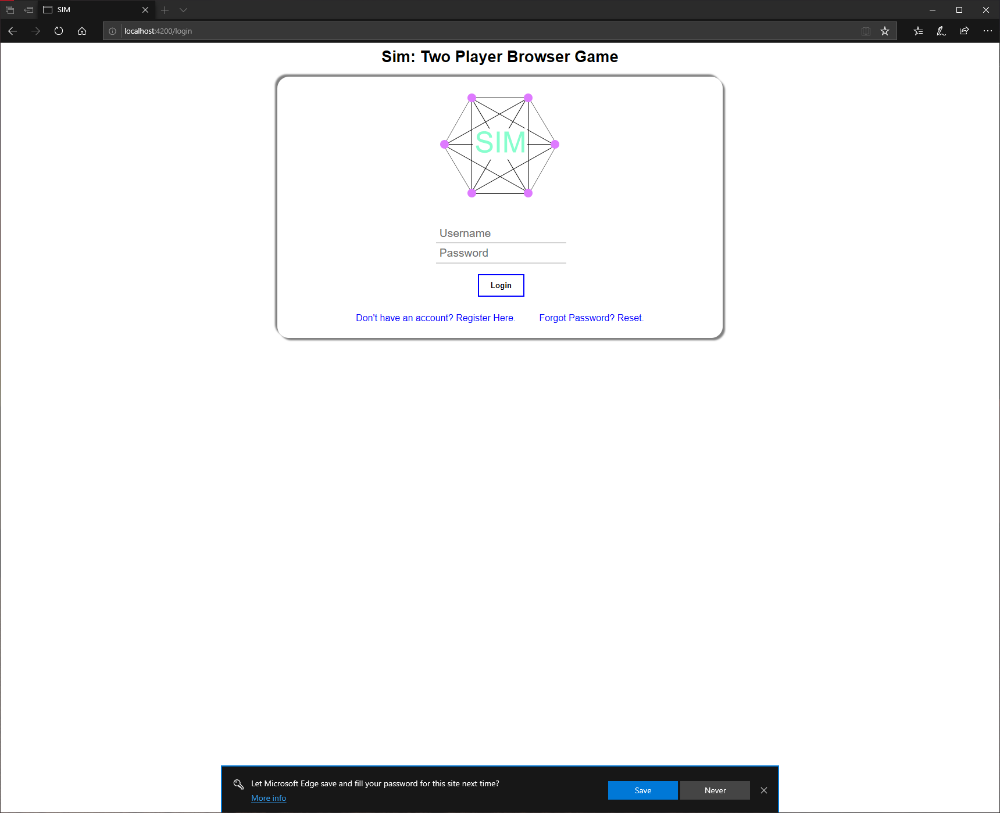
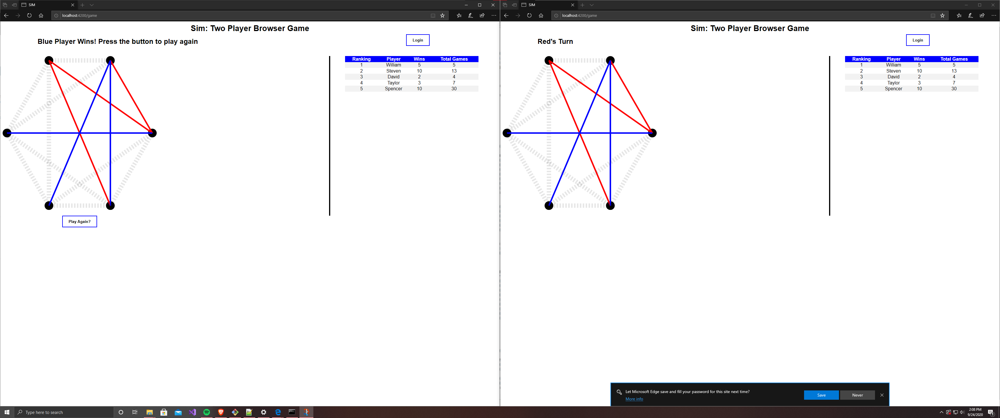

# SIM
A multiplayer online version of the paper and pen game [SIM](https://en.wikipedia.org/wiki/Sim_(pencil_game))  
Written by 4 classmates and I at NDSU  
[Steven Karschnia](https://github.com/steven-karschnia)  
[Taylor Schmidt](https://github.com/Taylor-Schmidt-NDSU)  
[Me](https://github.com/DavSchwartz)  
[Spencer Fjelstad](https://github.com/PixPanz)  
[William Deeken](https://github.com/wdeeken7)  

I wrote the majority of the game mechanics and let's all thank Taylor for doing the whole backend

## Users to login as (password same as username)
Will  
Taylor  
David  
Stephen  
Steve  

## How to run
Download python  
open Command Prompt  
install django, django-cors-headers, django-tastypie: `pip install django django-cors-headers django-tastypie`  
cd into SIM\Django\backend  
start server: `python manage.py runserver`  

download node.js  
open another Command Prompt  
install angular: `npm install -g @angular/cli`  
cd into SIM\Angular  
run app: `ng serve --open`  

open two instances  
login with 2 different users  
play!  
(its a long process)  

